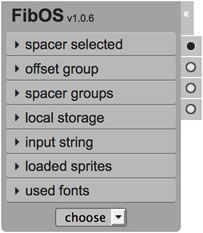
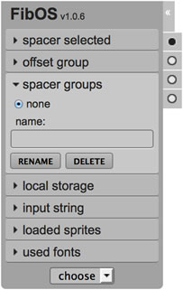

# FibOS
Bookmarklet UI Tool for easily check layout implementations

Use this string as "location" for the bookmarklet

    javascript:(function(){$.getScript("https://raw.githubusercontent.com/VenereDotCom/FibOS/latest/public/fibos-latest.min.js");})();

For Hotels.com use this one

    javascript:(function(){$.getScript("https://raw.githubusercontent.com/VenereDotCom/FibOS/latest/public/fibos-latest-hotels.min.js");})();

For Venere.com use this one

    javascript:(function(){$.getScript("https://raw.githubusercontent.com/VenereDotCom/FibOS/latest/public/fibos-latest-venere.min.js");})();

## Usage
Once the bookmarklet is loaded, the GUI will be appended to the body and it will be visible in the upper-left corner of the page.

The tools a [dropdown](#select-dropdown) for chosing spacers and other [6 panels](#panels) to manage them and other features as well.

The 6 panels are as follows:
- [spacer selected](#spacer-selected)
- [offset group](#offset-group)
- [spacer groups](#spacer-groups)
- [local storage](#local-storage)
- [input string](#input-string)
- [loaded sprites](#loaded-sprites)

Additionally, it has [4 toggles](#toggles) on the right side in order to show/hide specific features such as:
- [all spacers](#spacers)
- [a dark overlay](#overlay)
- [the rulers and lineguides](#rulers)
- [the font-info feature](#font-info)

---

### Select dropdown
Using the dropdown, a spacer can be chosen and then drag/drop onto the page.

Once the spacer is dropped onto the page, it still can be dragged around the page.

When a spacer is clicked (or when it's just dropped) it can be moved around using arrow keys:
- arrows moves it by 1 pixel
- while SHIFT key is pressed moves it by 10 pixels
- while ALT key is pressed moves it by 0.5 pixel (for retina displays)

---

## Panels

### Spacer Selected

Here the user can modify a specific spacer (already droppend onto the page).

The user can:
- change the spacer value
- change the spacer position (top and left)
- change the spacer opacity
- remove or duplicate the spacer

---

### Offset Group

Here the user can offset a full group of spacers.

Additionally the user can select an inner set of spacers for the selected group checking the 'select inner group' option.

---

### Spacer Groups

From here the user can choose between groups of spacers.

Once the first spacer is dropped onto the page, the first default group is created named 'spacerGroup_0', and then it can be renamed or removed using the relative buttons.

While new spacers are dropped when 'none' group is selected, the tool creates a new group named 'spacerGroup_N', where N is an incremental number for each newer group.

The user will always have the ability to choose a group from the list.

---

### Local Storage

Using HTML5LocalStorage feature, the user can save the current spacers groups or restore the previously saved ones.

Once the 'restore' button is pressed, the panel 'spacer groups' will be open showing all groups restored.

---

### Input String

In this panel the user can export in json format the current spacers groups (shown in the browser's console).

The user can also import a group set of spacers using the same json string returned after 'export' is clicked (useful for sharing spacers groups).

---

### Loaded Sprites

Once the 'analyze' button is pressed, the tool checks for all DOM elements with a css 'background-image' property set and stores sprite infos in a checkable list.

Checking a sprite from the list, the tool will show the selected sprite (or image) with red semi-transparent boxes representing the actual used pixels.

This is useful to check for re-usable areas of a sprite, or for easily check overlapping areas.

---

## Toggles

### Spacers
Click here to show/hide spacers.

NOTE: there is a known issue about dropping new spacers when this toggle is disabled. Please, be aware of this and avoid to drop-in new spacers when this toggle is disabled.

---

### Overlay
Click here to show/hide a dark semi-transparent overlay, in order to see all spacers more clearly.

---

### Rulers
Click here to show/hide rulers.

Once the rulers are shown, from both the horizontal or vertical ruler it can be dragged-in a new lineguide.

Once a lineguide is dropped onto the page, it can be moved with the mouse or arrow keys:
- arrows moves it by 1 pixel
- while SHIFT key is pressed moves it by 10 pixels
- while ALT key is pressed moves it by 0.5 pixel (for retina displays)

---

### Font-Info
Click here to show/hide the Marker feature.

While this toggle is active, the user can click on any text in the page revealing 2 type of informations:
- a cyano semi-transparent box over the text highlighting its block
- a small box on top of the text with font-family, font-weight and font-size css property

Enabling this toggle, will show all Markers alrady placed as well as enable the click event (which will prevent defaults, ie. for links).

Disabling this toggle, will hide all Markers already placed as well as disable the click event.
