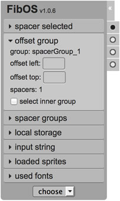
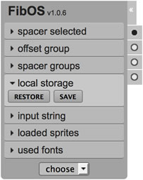

# FibOS
[Usage](#usage) |
[Build](#build) |
[Contributing](#contributing)

Bookmarklet UI Tool for easily check layout implementations.

---

## Usage
In order to load the tool at its **latest** release, use this string as "location" for the bookmarklet:

    javascript:(function(){$.getScript("https://raw.githubusercontent.com/VenereDotCom/FibOS/latest/public/fibos-latest.min.js");})();

To try the newest implementations load the **staging** release: will be the next _latest_ release, but still work in progress.

    javascript:(function(){$.getScript("https://raw.githubusercontent.com/VenereDotCom/FibOS/staging/public/fibos-latest.min.js");})();

For brands specific builds, like **hotels.com** or **venere.com**, please use the correct file:  
`fibos-latest-hotels.min.js` or `fibos-latest-venere.min.js`.

Alternatively, it can be loaded with a customizable loader:
```javascript
javascript:(function(brands,tags,brand,tag){!function(a,b){function c(a,b){for(var c,d={},e=0;e<a.length;e++)if(c=[],b.forEach(function(b){d[b]||(d[b]=0),a[e]==b[e]&&d[b]++,c.push({name:b,val:d[b]})}),c.sort(function(a,b){return b.val-a.val}),c[0].val>c[1].val)return c[0].name;return null}a||(a=prompt("Choose brand\n[ "+brands.join(" | ")+" ]\n\n(leave it blank for '"+brands[0]+"')")||brands[0]),b||(b=prompt("Choose tag\n[ "+tags.join(" | ")+" ]\n\n(leave it blank for '"+tags[0]+"')")||tags[0]),-1===brands.indexOf(a)&&(a=c(a,brands)||a),-1===tags.indexOf(b)&&(b=c(b,tags)||b);var d=["VenereDotCom/FibOS/",b,"/public/fibos-latest-",a,".min.js"].join(""),e="https://rawgit.com/"+d,f=document.createElement("script");f.type="text/javascript",f.src=e,document.getElementsByTagName("head")[0].appendChild(f),console.log("loaded",e)}(brand,tag);}(["hotels","venere"],["latest","staging"],null,null));
```
If parameters are passed instead of `null`, first or second or both questions will be skipped.  
This minified version of [`prompt.js`](https://github.com/VenereDotCom/FibOS/blob/release_1.0.5/src/prompt.js) can be obtained using the [`grunt prompt`](#loader-prompt-version) command.

Once the bookmarklet is loaded, the GUI will be appended to the body and it will be visible in the upper-left corner of the page. Starting from `v1.0.3+` it can also be dragged around the page clicking on the title.


The tool has a [dropdown](#select-dropdown) for chosing spacers, [6 panels](#panels) to manage them and [4 toggles](#toggles) on the right side to show/hide specific features.

The 6 panels are as follows:
- [spacer selected](#spacer-selected)
- [offset group](#offset-group)
- [spacer groups](#spacer-groups)
- [local storage](#local-storage)
- [input string](#input-string)
- [loaded sprites](#loaded-sprites)

The 4 toggles on the right side enable features as follows:
- [toggle all spacers](#spacers)
- [toggle dark overlay](#overlay)
- [toggle rulers and lineguides](#rulers)
- [toggle font-info feature](#font-info)

---

### Select dropdown
Using the dropdown, a spacer can be chosen and then dragged/dropped onto the page.  
Once the spacer is dropped, it still can be dragged around the page.

When a spacer is clicked (or when it's just dropped) it can be moved around using arrow keys:
- arrows moves it by 1 pixel
- while SHIFT key is pressed moves it by 10 pixels
- while ALT key is pressed moves it by 0.5 pixel (for retina displays)

---

## Panels

### Spacer Selected


Here the user can modify a specific spacer (already dropped onto the page).

The user can:
- change the spacer value
- change the spacer position (top and left)
- change the spacer opacity
- remove or duplicate the spacer (also using shortcuts respectively: `ALT+X` and `ALT+D`)

---

### Offset Group


Here the user can offset a full group of spacers.

Additionally the user can select an inner set of spacers for the selected group checking the 'select inner group' option.

---

### Spacer Groups


From here the user can choose between groups of spacers.

Once the first spacer is dropped onto the page, the first default group is created named 'spacerGroup_0', and then it can be renamed or removed using the relative buttons.

While new spacers are dropped when 'none' group is selected, the tool creates a new group named 'spacerGroup_N', where N is an incremental number for each newer group.

The user will always have the ability to choose a group from the list.

---

### Local Storage


Using [HTML5 localStorage](http://dev.w3.org/html5/webstorage/#the-localstorage-attribute) feature, the user can save the current spacers groups or restore the previously saved ones.

Once the 'restore' button is pressed, the panel 'spacer groups' will be open showing all groups restored.

---

### Input String


In this panel the user can export in json format the current spacers groups (shown in the browser's console).

The user can also import a group set of spacers using the same json string returned after 'export' is clicked (useful for sharing spacers groups).

---

### Loaded Sprites


Once the 'analyze' button is pressed, the tool checks for all DOM elements with a css `background-image` property set and stores sprites in a checkable list.

Checking a sprite from the list, the tool will show the selected sprite (or image) with red semi-transparent boxes representing the actual used pixels.

This is useful to check for re-usable areas of a sprite, overlapping areas, wrong areas set, and so on.

---

## Toggles

### Spacers
Click here to show/hide spacers.

---

### Overlay
Click here to show/hide a dark semi-transparent overlay, in order to see all spacers more clearly.

---

### Rulers
Click here to show/hide rulers.

Once the rulers are shown, from both the horizontal or vertical ruler it can be dragged-in a new lineguide.  
Once a lineguide is dropped onto the page, it can be moved with the mouse or arrow keys:
- arrows moves it by 1 pixel
- while SHIFT key is pressed moves it by 10 pixels
- while ALT key is pressed moves it by 0.5 pixel (for retina displays)

---

### Font-Info
Click here to show/hide the Marker feature.

While this toggle is active, the user can click on any text in the page revealing 2 type of informations:
- a cyan blue semi-transparent box over the text, highlighting its block
- a small box on top of the text with font-family, font-weight and font-size css properties

Enabling this toggle, will show all Markers alrady placed as well as enable the click event (which will prevent defaults, eg. for links).  
Disabling this toggle, will hide all Markers already placed as well as disable the click event.

---

## Build
First of all, [NodeJS](https://nodejs.org/download/) should be installed.

Once the project is cloned, go into the project's root folder and run:

```
npm install -g grunt-cli
npm install
grunt deploy
```

`grunt-cli` is the Grunt Command Line Interface needed to run Grunt tasks.

With `npm install` all node packages needed by the compiler will be installed into `node_modules/` folder.

With the `grunt deploy` command, all files for the project will be created under the `build/` (both minified and full, for debugging) and all the minified will be also copied into `public/[version]/` folder along with `*-latest.min.js` version in `public/` folder.

Eg. With the version `1.0.2`, running `grunt deploy` will produce this file tree:

```
public/
  |- fibos-latest.min.js
  |- fibos-latest-hotels.min.js
  |- fibos-latest-venere.min.js
  |- 1.0.2/
    |- fibos-1.0.2.min.js
    |- fibos-hotels-1.0.2.min.js
    |- fibos-venere-1.0.2.min.js
    |- widgets/
      |- uiMarker-1.0.2-min.js
      |- uiRuler-1.0.2-min.js
      |- uiSlider-1.0.2-min.js
      |- uiSpacer-1.0.2-min.js
      |- uiSpriter-1.0.2-min.js
      |- uiWidgets-1.0.2-min.js
```

#### Loader prompt version

| command | notes |
| ------- | ----- |
| `grunt prompt` | minifies the bookmarklet with custom params (ie. `prompt:[brand]:[tag]`) |

eg:  
`grunt prompt:venere` will have the loader to ask only for tag and assuming the brand to be `venere`.  
`grunt prompt::latest` will have the loader to ask only for brand and assuming the tag to be `latest`.  
`grunt prompt:hotels:staging` will have the loader to ask nothing, assuming the brand to be `hotels` and the tag `staging`.  
..and so on..

#### Folder cleaners
Dynamic folders are used as follows:
- target: (git ignores it) temporary folder to host processing files
- build:  (git ignores it) final folder to host built files (both minified and debuggable ones)
- public: (git stages it) final folder only for minified files

| command | notes |
| ------- | ----- |
| `grunt clean:target` | remove `target/` folder |
| `grunt clean:build` | remove `build/` folder |
| `grunt clean:deploy` | remove `public/[version]/` folder (and all the `public/*-latest.min.js` files) |
| `grunt clean:all` | removes ALL dynamic folders (`build/`, `target/`, `public/[version]/`) |

#### Single Widget builders

| command | notes |
| ------- | ----- |
| `grunt widget:marker` | build/minify MARKER widget into `build/[version]/widgets/` |
| `grunt widget:ruler` | build/minify RULER widget into `build/[version]/widgets/` |
| `grunt widget:slider` | build/minify SLIDER widget into `build/[version]/widgets/` |
| `grunt widget:spacer` | build/minify SPACER widget into `build/[version]/widgets/` |
| `grunt widget:spriter` | build/minify SPRITER widget into `build/[version]/widgets/` |

#### All Widgets

| command | notes |
| ------- | ----- |
| `grunt widgets-all` | build/minify ALL widgets into `build/[version]/widgets/`
| `grunt widgets-test` | build/minify ALL widgets with test initializer into `build/[version]/widgets/`

#### Full builders

| command | notes |
| ------- | ----- |
| `grunt build` | build/minify FibOS with default initializer into `build/[version]/` |
| `grunt build:venere` | build/minify FibOS with VENERE initializer into `build/[version]/` |
| `grunt build:hotels` | build/minify FibOS with HOTELS initializer into `build/[version]/` |
| `grunt build-all` | build/minify FibOS with ALL initializers and ALL widgets into `build/[version]/` |
| `grunt deploy` | build/minify ALL into `build/[version]/` and copy only minified into `public/[version]/` |

With `grunt deploy` will be created also all *-latest.min.js files per brand into `public/` folder.

---

## Contributing

### Custom initializer
To set up a new initializer (as for venere or hotels already set) please follow these steps:

1. add the new brand under `pkg.brands` into `package.json` file (kay/value pair is brandName/brandMsg)  
_note: the brandMsg will be used in the final minified file as comment in this form:_  
`/** built for <%= brandMsg %> **/`

2. create the new init file under `src/app/init/`  
_note: the initializer file serves as options overrider for each widget that needs to be customized. The `FibOS()` constructor accept a selector as first parameter so that the whole tool works only inside of it (should be the main website wrapper element selector, if `null` the tool will work for `body` selector)._

3. enhance the `build-all` grunt task into the Gruntfile (this is optional though recomended)  
_note: if the brand "newbrand" is intended to be added, add the `build` task with the new brand as parameter, so that Grunt can append the correct initializer found in `src/app/init/fibos_newbrand.js`, or simply run `grunt build:newbrand` in command line._

eg. for a brand named `newbrand` the file `src/app/init/fibos_newbrand.js` should be created with following content as example:
```javascript
/* [1] : package.json */
//...
"brands": {
  "hotels":"HOTELS.COM",
  "venere":"VENERE.COM",
  "newbrand":"MY PERSONAL COMPANY"
},
//...

/* [2] : src/app/init/fibos_newbrand.js */
var myOptions = {
    logEvents: true,
    uiSpacer:  {spacersList:[5,10,15,20,25,30,35,40],spacerMin:1},
    uiRuler:   {rulerWidth:8},
    uiMarker:  {taglist:{a:false,input:false,dfn:true}},
    uiSpriter: {domain:'img.mydomain.com'}
};
var fibos = new FibOS('#elemId.elemClass', myOptions);

/* [3] : Gruntfile.js */
// ...
grunt.registerTask('build-all', [
    'clean:build', 'build', 'build:hotels', 'build:venere', 'build:newbrand',
    'widget:marker', 'widget:ruler', 'widget:slider', 'widget:spacer', 'widget:spriter', 'widgets-all'
]);
// ...
```

---

## Credits
Created by [Fabio Di Monte](https://github.com/FabioDiMonte), with thanks to: [Daniele Amurri](https://github.com/damurri), [Simone Rescio](https://github.com/srescio), [Gianluca Bargelli](https://github.com/proudlygeek), [Claudio Corridore](https://github.com/ClaudioCorridore), [Francesco Saverio Ferrara](https://github.com/fsferrara).

## Legal
This project is available under the [Apache 2.0 License](http://www.apache.org/licenses/LICENSE-2.0.html).
